---
## Front matter
title: "Отчёт по лабораторной работе 5"
subtitle: "Архитектура компьютеров"
author: "Ел Вакил Марьям Махмоудовна НБИбд-03-23"

## Generic otions
lang: ru-RU
toc-title: "Содержание"

## Bibliography
bibliography: bib/cite.bib
csl: pandoc/csl/gost-r-7-0-5-2008-numeric.csl

## Pdf output format
toc: true # Table of contents
toc-depth: 2
lof: true # List of figures
lot: true # List of tables
fontsize: 12pt
linestretch: 1.5
papersize: a4
documentclass: scrreprt
## I18n polyglossia
polyglossia-lang:
  name: russian
  options:
	- spelling=modern
	- babelshorthands=true
polyglossia-otherlangs:
  name: english
## I18n babel
babel-lang: russian
babel-otherlangs: english
## Fonts
mainfont: PT Serif
romanfont: PT Serif
sansfont: PT Sans
monofont: PT Mono
mainfontoptions: Ligatures=TeX
romanfontoptions: Ligatures=TeX
sansfontoptions: Ligatures=TeX,Scale=MatchLowercase
monofontoptions: Scale=MatchLowercase,Scale=0.9
## Biblatex
biblatex: true
biblio-style: "gost-numeric"
biblatexoptions:
  - parentracker=true
  - backend=biber
  - hyperref=auto
  - language=auto
  - autolang=other*
  - citestyle=gost-numeric
## Pandoc-crossref LaTeX customization
figureTitle: "Рис."
tableTitle: "Таблица"
listingTitle: "Листинг"
lofTitle: "Список иллюстраций"
lotTitle: "Список таблиц"
lolTitle: "Листинги"
## Misc options
indent: true
header-includes:
  - \usepackage{indentfirst}
  - \usepackage{float} # keep figures where there are in the text
  - \floatplacement{figure}{H} # keep figures where there are in the text
---

# Цель работы

Целью работы является приобретение практических навыков работы в Midnight Commander. 
Освоение инструкций языка ассемблера mov и int.

# Задания

1. Изучение Midnight Commander

2. Рассмотреть примеры программ ввода/вывода

3. Рассмотреть примеры программ ввода/вывода с использованием внешнего файла in_out.asm

3. Выполнение заданий для самостоятельной работы.

# Выполнение лабораторной работы

## Основы работы в Midnight Commander

Я запустила Midnight Commander и направилась в каталог ~/work/arch-pc, чтобы приступить к выполнению лабораторной работы. Внутри этого 
каталога создала новую папку с именем lab05 для хранения файлов текущего задания.

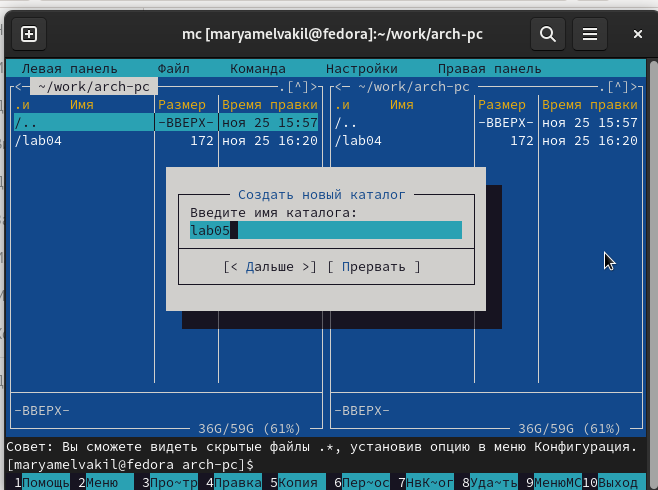{ #fig:001 width=70%, height=70% }

Далее внутри папки lab05 создаю файл под названием lab05-1.asm - это будет мой рабочий файл для написания кода программы в ассемблере.

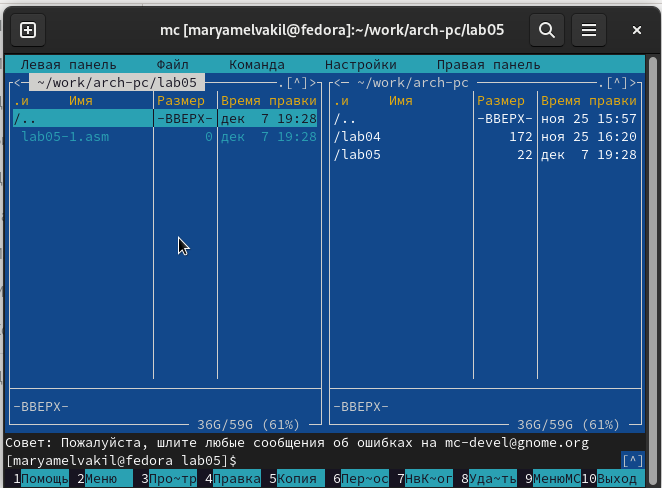{ #fig:002 width=70%, height=70% }

Я открыла файл lab05-1.asm для редактирования и написала в нем код программы. 

{ #fig:003 width=70%, height=70% }

После этого открыла файл для просмотра и убедилась, что он содержит написанный мной 
код.

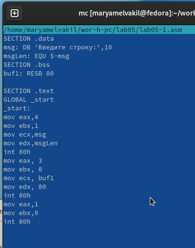{ #fig:004 width=70%, height=70% }

Затем скомпилировала программу и проверила ее работу, получив исполняемый файл.

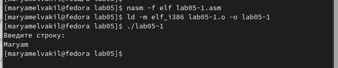{ #fig:005 width=70%, height=70% }

## Подключение внешнего файла in_out.asm

Загрузила вспомогательный файл in_out.asm, содержащий полезные подпрограммы, и сохранила его в своей рабочей папке.Затем я скопировала файл lab05-1.asm и создала копию с именем lab05-2.asm.

Скопирую файл с программой

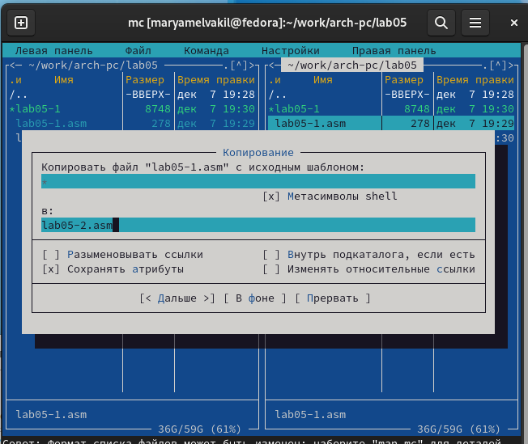{ #fig:006 width=70%, height=70% }

Написала код программы в файле lab05-2.asm.

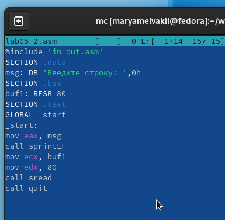{ #fig:007 width=70%, height=70% }

После этого я скомпилировала программу и проверила ее запуск.

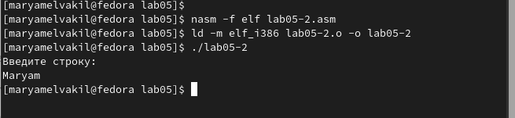{ #fig:008 width=70%, height=70% }

В файле lab05-2.asm внесла изменения, заменив подпрограмму sprintLF на sprint. 

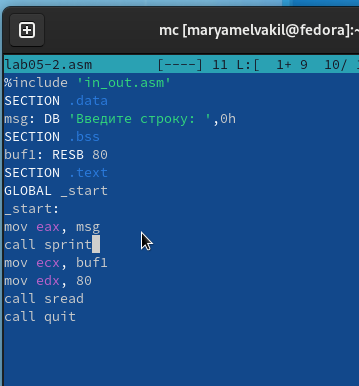{ #fig:009 width=70%, height=70% }

Это позволило строке вывода не завершаться символом перехода на новую строку.

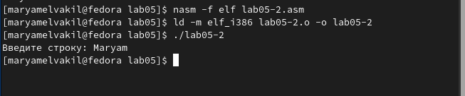{ #fig:010 width=70%, height=70% }

##  Задание для самостоятельной работы

Нужно скопировать lab05-1.asm и внести изменения в код, чтобы программа 
выводила приглашение "Введите строку:", затем считывала строку с клавиатуры 
и выводила ее на экран.

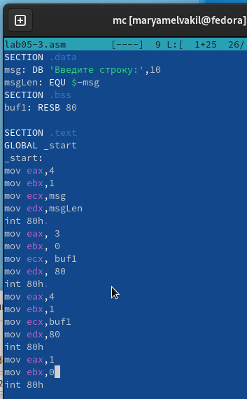{ #fig:011 width=70%, height=70% }

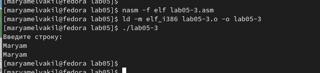{ #fig:012 width=70%, height=70% }

Также нужно скопировать программу lab05-2.asm и сделать аналогичные изменения.

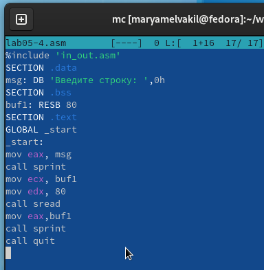{ #fig:013 width=70%, height=70% }

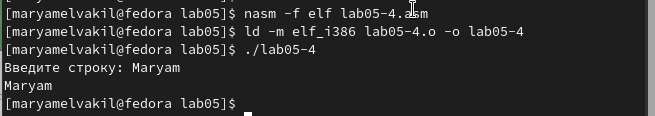{ #fig:014 width=70%, height=70% }

Отличие между этими двумя реализациями заключается в том, что файл in_out.asm уже содержит готовые подпрограммы для обеспечения ввода/вывода. Таким образом, нам остается только разместить данные в нужных регистрах и вызвать нужную подпрограмму с помощью инструкции call. Это упрощает кодирование и обеспечивает более гибкую работу с вводом и выводом данных.

# Выводы

Научились писать базовые ассемблерные программы. Освоили ассемблерные инструкции mov и int.