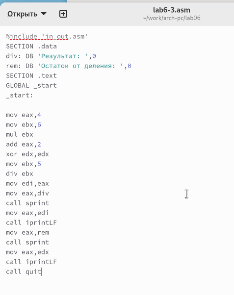
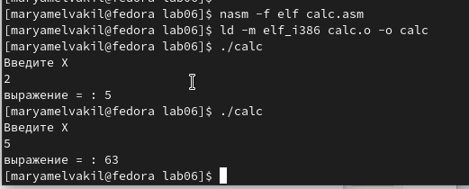

---
## Front matter
title: "Отчёт по лабораторной работе 6"
subtitle: "Архитектура компьютеров"
author: "Ел Вакил Марьям Махмоудовна НБИбд-03-23"

## Generic otions
lang: ru-RU
toc-title: "Содержание"

## Bibliography
bibliography: bib/cite.bib
csl: pandoc/csl/gost-r-7-0-5-2008-numeric.csl

## Pdf output format
toc: true # Table of contents
toc-depth: 2
lof: true # List of figures
lot: true # List of tables
fontsize: 12pt
linestretch: 1.5
papersize: a4
documentclass: scrreprt
## I18n polyglossia
polyglossia-lang:
  name: russian
  options:
	- spelling=modern
	- babelshorthands=true
polyglossia-otherlangs:
  name: english
## I18n babel
babel-lang: russian
babel-otherlangs: english
## Fonts
mainfont: PT Serif
romanfont: PT Serif
sansfont: PT Sans
monofont: PT Mono
mainfontoptions: Ligatures=TeX
romanfontoptions: Ligatures=TeX
sansfontoptions: Ligatures=TeX,Scale=MatchLowercase
monofontoptions: Scale=MatchLowercase,Scale=0.9
## Biblatex
biblatex: true
biblio-style: "gost-numeric"
biblatexoptions:
  - parentracker=true
  - backend=biber
  - hyperref=auto
  - language=auto
  - autolang=other*
  - citestyle=gost-numeric
## Pandoc-crossref LaTeX customization
figureTitle: "Рис."
tableTitle: "Таблица"
listingTitle: "Листинг"
lofTitle: "Список иллюстраций"
lotTitle: "Список таблиц"
lolTitle: "Листинги"
## Misc options
indent: true
header-includes:
  - \usepackage{indentfirst}
  - \usepackage{float} # keep figures where there are in the text
  - \floatplacement{figure}{H} # keep figures where there are in the text
---

# Цель работы

Целью работы является освоение арифметических инструкций языка ассемблера NASM.

# Задание

1. Изучить синтаксис арифметических операций в ассемблере

2. Разобрать примеры программ с символьными и численными данными

3. Разобрать примеры апрограмм с вычислениями

4. Изучить программы вычисления варианта и определить свой вариант

5. Выполнить самостоятельное задание по варианту

# Выполнение лабораторной работы

## Символьные и численные данные в NASM

Создаю каталог для программам лабораторной работы № 6, перехожу в него и создаю файл lab6-1.asm. 

Давайте разберёмся с примерами программ, которые выводят символы и числа. Эти программы будут показывать значения, которые мы занесём в регистр eax.

В программе, которую я сейчас рассматриваю, в регистр eax помещается символ '6' 
с помощью команды mov eax, '6', а в регистр ebx записывается символ '4' – mov ebx, '4'. 
Затем я прибавляю значение, хранящееся в регистре ebx, к значению регистра eax, 
используя команду add eax, ebx, и результат сложения сохраняется в регистре eax. 

Для того чтобы функция sprintLF смогла работать правильно, в регистре eax должен 
быть адрес, поэтому мне нужно использовать дополнительную переменную. Я переношу значение 
из регистра eax в переменную buf1 командой mov [buf1], eax, а потом записываю адрес 
переменной buf1 обратно в регистр eax с помощью команды mov eax, buf1 перед тем, 
как вызвать функцию sprintLF.

{ #fig:001 width=70%, height=70% }

Я ожидаю увидеть на экране число 10, когда выведу значение регистра eax. Но вместо этого 
у меня отображается символ 'j'. Это происходит потому, что в двоичном коде символ 
'6' представлен как 00110110 (или 54 в десятичной системе), а символ '4' – как 00110100 
(52 в десятичной системе). Когда я выполняю сложение командой add eax, ebx, в регистре 
eax оказывается сумма этих кодов – 01101010 (или 106 в десятичной системе), что 
соответствует коду символа 'j'.

{ #fig:002 width=70%, height=70% }

Далее изменяю текст программы и вместо символов, запишем в регистры числа.

{ #fig:003 width=70%, height=70% }

Как и раньше, при выполнении программы я не получила число 10. На этот раз на экране 
появился символ с кодом 10, который представляет собой символ конца строки или 
возврат каретки. Хоть он и не виден в консоли, он добавляет пустую строку.

{ #fig:004 width=70%, height=70% }

Как было сказано ранее, в файле in_out.asm для работы с числами предусмотрены 
специальные подпрограммы, которые преобразуют ASCII символы в числа и наоборот. 
Я использовала эти функции, чтобы преобразовать текст программы.

{ #fig:005 width=70%, height=70% }

{ #fig:006 width=70%, height=70% }

Так же, как и в предыдущем примере, я изменила символы на числа.

{ #fig:007 width=70%, height=70% }

Благодаря функции iprintLF, которая позволяет выводить число, и тому, что операндами были именно числа, а не коды символов, я получила число 10.

{ #fig:008 width=70%, height=70% }

Я заменила функцию iprintLF на iprint, создала исполняемый файл и запустила его. 
Результат отличался тем, что в выводе не было переноса строки.

{ #fig:009 width=70%, height=70% }

## Выполнение арифметических операций в NASM

 В качестве примера выполнения арифметических операций в NASM приведем 
программу вычисления арифметического выражения $f(x) = (5 * 2 + 3)/3$.

{ #fig:010 width=70%, height=70% }

{ #fig:011 width=70%, height=70% }

Изменила текст программы для вычисления выражения 
$f(x) = (4 * 6 + 2)/5$. 
Создала исполняемый файл и проверила его работу.

{ #fig:012 width=70%, height=70% }

{ #fig:013 width=70%, height=70% }

В качестве другого примера рассмотрим программу вычисления варианта задания по 
номеру студенческого билета.

В этом случае, число, с которым предстоит работать, мы вводим с помощью клавиатуры. 
Ранее я уже упоминала, что ввод осуществляется в символьном формате, 
и чтобы арифметические операции выполнялись правильно в NASM, эти символы нужно 
конвертировать в числовой формат. Сделать это можно с помощью функции atoi, которая 
находится в файле in_out.asm.

{ #fig:014 width=70%, height=70% }

{ #fig:015 width=70%, height=70% }

### Ответы на вопросы

1. Какие строки листинга отвечают за вывод на экран сообщения ‘Ваш вариант:’?

Команда "mov eax, rem" загружает в регистр eax строку с текстом "Ваш вариант:".

Команда "call sprint" инициирует вывод строки на экран.

2. Для чего используется следующие инструкции?

Команда "mov ecx, x" копирует значение из переменной x в регистр ecx.

Команда "mov edx, 80" помещает число 80 в регистр edx.

Команда "call sread" активирует функцию для ввода данных студенческого билета с клавиатуры.

3. Для чего используется инструкция “call atoi”?

Команда "call atoi" преобразует введённые символы в целое число.

4. Какие строки листинга отвечают за вычисления варианта?

Команда "xor edx, edx" очищает регистр edx.

Команда "mov ebx, 20" помещает число 20 в регистр ebx.

Команда "div ebx" выполняет деление номера студенческого на 20.

Команда "inc edx" прибавляет единицу к значению в регистре edx.

При этом выполняется деление номера студенческого билета на 20, а остаток от деления, хранящийся в регистре edx, увеличивается на 1.

5. В какой регистр записывается остаток от деления при выполнении инструкции “div ebx”?

Остаток от деления помещается в регистр edx.

6. Для чего используется инструкция “inc edx”?

Команда "inc edx" увеличивает на единицу значение в регистре edx, что необходимо для расчёта варианта по формуле.

7. Какие строки листинга отвечают за вывод на экран результата вычислений? 

Команда "mov eax, edx" переносит результат вычислений в регистр eax.

Команда "call iprintLF" запускает функцию, которая выводит результат на экран.

## Выполнение заданий для самостоятельной работы.

Написать программу вычисления выражения y = f(x). Код программы должна выводить выражение 
для вычисления, выводить запрос на ввод значения x, 
вычислять заданное выражение в зависимости от введенного x, выводить результат вычислений. 
Вид функции f(x) выбрать из таблицы 6.3 вариантов заданий в соответствии с номером 
полученным при выполнении лабораторной работы. 
Создайте исполняемый файл и проверьте его работу для значений x1 и x2 из 6.3.

Получили вариант 8 - $x^3/2 + 1$  для $x=2, x=5$

{ #fig:016 width=70%, height=70% }

При $x=2$ получается  5.

При $x=5$ получается  63.5. (программа выводит 63, так как деление целочисленное)

{ #fig:017 width=70%, height=70% }

Код программы считает верно.

# Выводы

Изучили работу с арифметическими операциями.